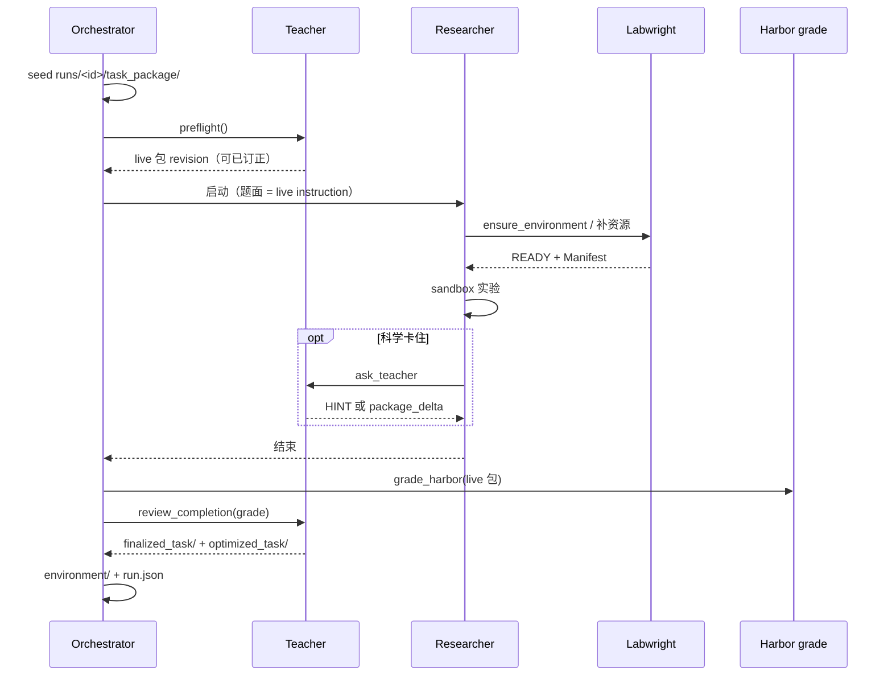
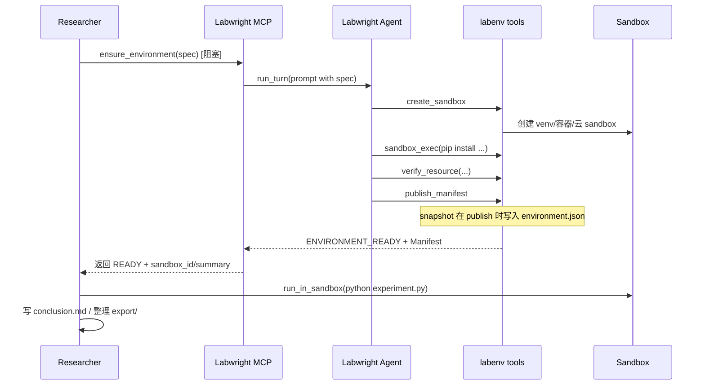
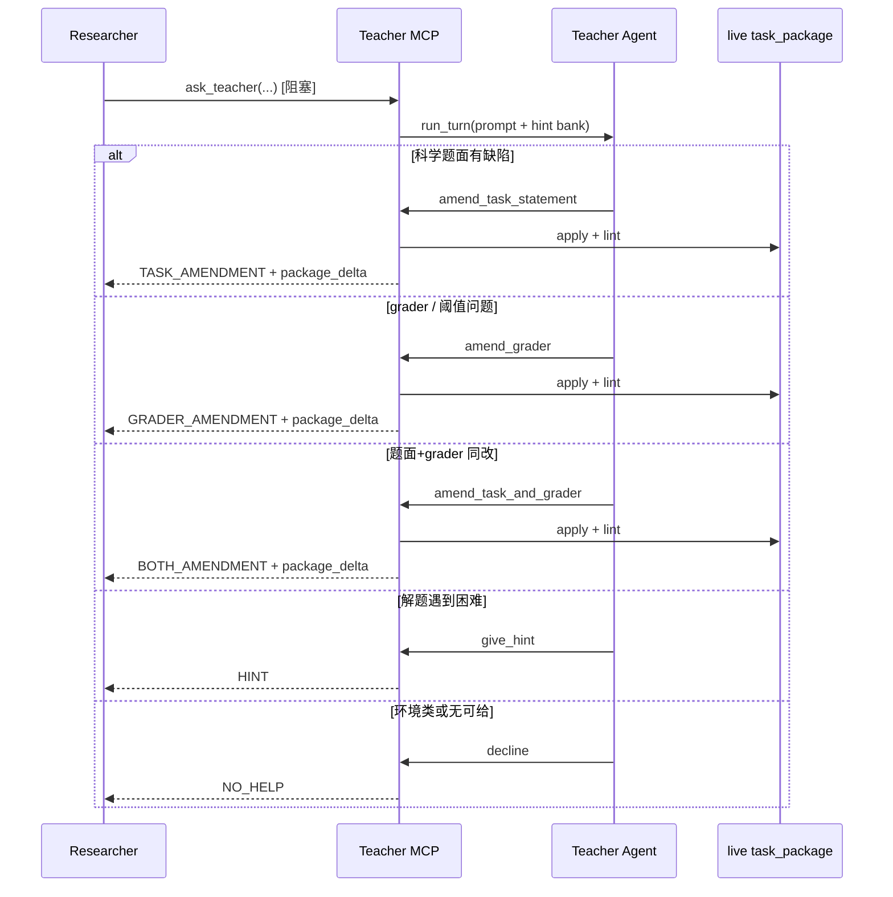

# AGENT.md — 0 号机三 Agent 设计

本文档说明 `zero` 包中 **Researcher**、**Labwright**、**Teacher** 三个 Claude Code Agent 的设计思路、职责边界与协作方式。修改 agent 相关代码前建议先读一遍。

> 怎么跑任务、配环境变量，见 [`README.md`](./README.md)。本文只讲**内部设计**。

## 一句话

0 号机是一个**三 Agent 科学实验系统**：Researcher 负责「做什么实验」，Labwright 负责「把环境搭好」，Teacher 负责「策展题包 + 解题提示」——开跑前 Preflight、解题中 HINT / 热更新 live 题包、结题冻结定稿；三者通过**结构化 MCP 工具**通信，各自拥有**独立的 Claude Code 会话**与**独立的上下文**。三者均具备完整宿主侧 Claude Code 工具集；职责分工由 system prompt 与 MCP 合约指导，而非工具权限隔离。

**产品目标**：一次 run 交付更好的题包（`finalized_task/`）与可复现环境，而不是抬高本次 Researcher 分数。

### 职责切分（硬边界）

| Agent | 该管 | 不该管 |
|------|------|--------|
| **Labwright** | 工具、依赖、数据、镜像、挂载、打包可跑环境；题面声明的 starter / `/app/...` 是否到位 | 改科学题面、给解题 hint |
| **Teacher** | Preflight / live 包订正；科学 HINT；题面或 grader 相对文献有缺陷 → `TASK` / `GRADER` / `BOTH_AMENDMENT` | 路径、镜像、装包、「文件夹在哪」——那是环境，应 `decline`；禁止为抬分放宽阈值 |
| **Researcher** | 读题、设计、写代码、分析、结论；环境问题找 Labwright，科学卡壳才问 Teacher | 把装环境问成改题面 |

### 实际执行边界（读代码时别被旧注释骗）

| 机制 | 现状 |
|------|------|
| 宿主工具 | 三 Agent 都拿到完整 `HOST_TOOLS`（Bash / Read / Write / Edit / Glob / Grep / Web*） |
| Researcher 装环境约束 | **prompt 约定**：常规依赖走 Labwright。`researcher/hooks.py` 里有拦截 hooks，**默认未挂进 SDK options** |
| Teacher | 可查本地 hint / 论文上下文；解题一轮以 `hintbank` 终端工具结束（`HINT` / `TASK_AMENDMENT` / `GRADER_AMENDMENT` / `BOTH_AMENDMENT` / `NO_HELP`）；订正写回 `task_package/` 且须过 lint |
| Live 题包 | `runs/<id>/task_package/` 是唯一真相；`package_revisions/` 留快照；结题冻结 `finalized_task/` |
| Playground MCP | Researcher allowlist 含 `mcp__playground__*`；**默认编排不注册**，需调用方经 `mcp_server_factory` 注入。lbg 后端会尽力在 sandbox 内装 playground CLI |

## 设计原则

| 原则 | 含义 |
|------|------|
| **声明式环境** | Researcher 只声明「需要什么」（`EnvironmentSpec`），不指定「怎么装」 |
| **上下文隔离** | 三个 Agent 各跑一个 CC 会话，互不污染对话历史 |
| **工具化协作** | Agent 之间通过代码定义的 MCP 工具交互，而不是自然语言私聊 |
| **Agent 驱动部署** | Labwright 是完整 Agent，自己规划、试错、修复；**没有外部状态机** |
| **可验证交付** | 环境就绪 = Manifest 里每项资源都经过真实检查，不是 `pip install` 返回 0 就行 |
| **语义边界清晰** | 工程问题 Labwright 自己解决；会改变实验语义的歧义（模型来源、数据集版本等）必须 `NEEDS_DECISION` 交给 Researcher |
| **订正只碰科学题面 / grader** | Teacher 的订正不碰部署说明、镜像标签、宿主机路径；写回须过 lint |
| **全程可追踪** | `capgw` 记录每次 LLM 调用；编排层记录工具调用与状态事件，按 `task_id` 缝合 |
| **一次运行一个大文件夹** | `runs/<id>/` 是唯一产物根；删文件夹即释放 run 名（无全局幽灵 DB） |

## 系统全景

典型部署是**双层目录**：

```
ZERO_ROOT（默认可指向 monorepo 根，如 /personal/zero）
├── agent_skills/{researcher,labwright,teacher}/   # 共享 Skills 输入
├── experience/researcher/                         # 跨 run 经验库
├── tasks/<name>/                                  # 题包（input）
├── runs/<run>/                                    # 唯一运行产物
└── zero/                                          # 本 Python 包（pip install -e .）
    ├── AGENT.md / README.md / .env
    ├── capgw/                                     # 捕获网关
    └── zero/                                      # import zero
```

```
用户任务（题面文本，或经 ExternalTaskPreparer 准备后的上下文）
   │
   ▼
Orchestrator ── 创建 task_id / workspace / runs/<id>/meta/task.json / 双层轨迹
   │              （可选：ZeroRuntime 共享一个 capgw，并发跑多个 Orchestrator）
   │
   ├── Researcher（Claude Code，一次性 query 会话）
   │      ├── 宿主工具：Bash / Read / Write / Edit / Glob / Grep / Web*
   │      ├── mcp__sandbox__*     在 Sandbox 里跑实验代码
   │      ├── mcp__labwright__*   声明环境、补资源、回复决策
   │      ├── mcp__teacher__*     卡住时提问（若启用）
   │      ├── mcp__experience__*  检索 / 写入跨 run 经验库
   │      └── mcp__researcher_skill_capture__*  提出 Skill 候选
   │
   ├── Labwright（Claude Code，持久 ClaudeSDKClient 会话）
   │      ├── 宿主工具：Bash / Read / Write / Edit / Glob / Grep / Web*
   │      ├── mcp__labenv__*      创建 sandbox、安装、搜集、挂载、验证、发布 Manifest
   │      └── mcp__labwright_skill_capture__*  提出环境类 Skill 候选
   │
   └── Teacher（Claude Code，持久 ClaudeSDKClient，按需懒启动）
          ├── 宿主工具：Bash / Read / Write / Edit / Glob / Grep / Web*
          └── mcp__hintbank__*    读 hint、给 HINT、订正题面、拒答

capgw（透明代理）── 三个 Agent 的模型调用分别落到
                    runs/<task_id>/trace/researcher.jsonl
                    runs/<task_id>/trace/labwright.jsonl
                    runs/<task_id>/trace/teacher.jsonl（从未被问到时不产生）
```

`agent_skills`、`experience/researcher`、`tasks` 是共享输入；一次任务的全部运行产物都在 `runs/<task_id>/`。

## 目录约定

| 路径 | 含义 |
|------|------|
| `runs/<task_id>/` | 该次运行的唯一产物根 |
| `runs/<task_id>/meta/task.json` | 生命周期状态（JSON；类名仍叫 `StateDB`，**不是** SQLite） |
| `runs/<task_id>/resources/` | Labwright 下载与缓存 + `manifest.json` / `index.json` |
| `runs/<task_id>/sandboxes/` | local 后端 sandbox |
| `runs/<task_id>/logs/` | 含 capgw.log |
| `runs/<task_id>/meta/skill_candidates/` | 本 run 提出的 Skill 候选 |
| `runs/<task_id>/meta/experience_writes.jsonl` | 本次经验库写入审计（若有） |
| `runs/<task_id>/workspace/` | 三 Agent 的宿主 cwd |
| `runs/<task_id>/trace/` | Layer 1（capgw）+ Layer 2（编排 events） |
| `runs/<task_id>/teacher/` | asks / 题面订正 / **本次** `hint_bank/` |
| `runs/<task_id>/deliverables/` | 结束时从 sandbox `export/{repo,output}` 拉回（需 Researcher 主动整理） |
| `runs/<task_id>/grading/` | Harbor 打分：`result.json` / `reward.txt` / `breakdown.json` |
| `runs/<task_id>/task_package/` | **Live** Harbor 题包（唯一真相；Teacher 热更新写回） |
| `runs/<task_id>/package_revisions/` | 题包 revision 快照 + CHANGELOG |
| `runs/<task_id>/finalized_task/` | 结题冻结的定稿题包（完整树） |
| `runs/<task_id>/optimized_task/` | 与 finalized 同步的兼容输出（含 OPTIMIZATION 历史） |
| `runs/<task_id>/environment/` | `environment.md`（人类可读）+ `inventory.json` + `pip-freeze.txt` + `image.json` |
| `runs/<task_id>/resolved_task.md` | 原始题面 + 本次全部权威 `TASK_AMENDMENT` |
| `runs/<task_id>/environment.json` | 环境索引（指向 inventory / md / imageUrl） |
| `runs/<task_id>/run.json` | 结束元数据与路径索引；`task_completed` **不**保证 `deliverables/` 非空 |
| `agent_skills/`、`tasks/` | 跨运行共享输入（Skills 需人工发布） |
| `experience/researcher/` | Researcher 轻量经验库（模型 `record_experience` 直写） |

capgw session key 固定为 `<task_id>/trace/<agent>`，因此模型轨迹直接落在
`runs/<task_id>/trace/<agent>.jsonl`。

## 三个 Agent

### Researcher — 科学主控

**职责**：理解任务 → 设计实验 → 声明环境 → 写代码 → 在 Sandbox 执行 → 分析结果 → 写 `conclusion.md`；可检索/沉淀跨 run 经验库；可提出研究方法类 Skill 候选。

**会话模型**：`query()` 一次性自治循环（`researcher/agent.py` → `claude_runtime.run_agent`）。一个 task 对应一轮完整对话，从任务 prompt 跑到 `ResultMessage`。

**工具边界**：

- ✅ 读写 workspace 里的实验代码与配置
- ✅ 完整宿主工具集；实验命令优先经 `run_in_sandbox`
- ✅ `run_in_sandbox` / `inspect_artifact` 执行与查看结果
- ✅ `ensure_environment` 等 Labwright 接口（声明式、阻塞交接）
- ✅ `mcp__experience__*`：检索 / 读取 / **主动写入**共享经验库
- ✅ `propose_reusable_skill`：提出候选（不直接改共享 Skills 目录）
- ℹ️ 常规环境准备仍优先经 Labwright，以保留可复现 Manifest
- ℹ️ Harbor / 竞赛题常把交付写到 `/app/outputs`；`runs/.../deliverables/` 只拉 `export/` 树——两者不是同一路径，需 Researcher 整理或事后用脚本补拉

**经验库 vs Skills**：短教训 → `record_experience`（立即进 `experience/researcher/`）；长流程 → `propose_reusable_skill`（人工审核）。

**capgw session key**：`<task_id>/trace/researcher`

### Labwright — 环境工程师

**职责**：把 `EnvironmentSpec` 变成已验证的 Sandbox；把题面声明的 starter / 镜像内容 / 数据挂进可跑环境；安装失败时自己诊断重试；语义歧义时暂停并请求 Researcher 决策；也可在外部集成里跑 `ExternalTaskPreparer` 做题前准备与交付校验。

**会话模型**：`ClaudeSDKClient` **持久多轮会话**（`labwright/agent.py`）。同一个 task 内，`ensure_environment`、`add_resources`、`resolve_environment_decision`、`report_environment_issue` 各自触发一轮 `run_turn(prompt)`，但**共享同一段对话记忆**。

**工具边界**：

- ✅ 完整宿主工具集；用 Bash / Read / Write / Edit 诊断与交付环境
- ✅ `labenv` 全套工具；sandbox 内安装、验证和资源挂载优先经 `labenv`
- ❌ 不写实验代码、不替 Researcher 做科学选择（模型精度、数据集版本等）
- ❌ 不订正科学题面（路径/镜像问题用交付或 `mark_failed`，不推给 Teacher）

**capgw session key**：`<task_id>/trace/labwright`

### Teacher — 题包策展 + 科学助教

**职责**：hint bank；`preflight` → 解题中 HINT / 热更新 live 包 → 结题 `review_completion` → 冻结 `finalized_task/`（+ `optimized_task/`）。

**修包条**：完整、自包含规范只在 `agent_skills/teacher/skills/teaching/SKILL.md`；不要抬本次 Researcher 分、不发明 gold、不泄答案。

**Live**：真相 `task_package/`；历史 `package_revisions/`；Researcher 只见 `package_delta`。预算：`ZERO_TEACHER_MAX_ASKS`、`ZERO_PACKAGE_MAX_REVISIONS`。

**capgw**：`<task_id>/trace/teacher`

### 为什么 Labwright 必须是 full agent？

环境部署本质是**开放域工程问题**：依赖冲突、网络超时、源不可用、传递依赖缺失……固定状态机很难覆盖。让 Agent 带着上下文不断「看 stderr → 换命令 → 再试」更贴近真实运维。

早期 MVP 曾用代码状态机 + 失败时调一次诊断 LLM；现已移除，统一为 Agent 驱动。

## Skills（已加载的共享插件）

插件根目录由 `ZERO_*_SKILLS` 解析，默认同 `ZERO_ROOT/agent_skills/<role>`：

| Role | Skill | 作用 |
|------|-------|------|
| Researcher / Labwright | `lbg-cli` | Bohrium `lbg sdbx` 生命周期、模板、镜像 commit、装包与 pitfall |
| Researcher / Labwright | `sandbox-root` | 默认以 root 进入；维护 `/workspace` 与 `/app/outputs`；勿把交付改写到 `~/app` |
| Researcher | `ask-teacher` | 何时、如何问 Teacher |
| Teacher | `teaching` | HINT / 订正 / decline 的动作规范与 anti-leak |

候选 Skill 仍走 `meta/skill_candidates/` → `zero skills validate|publish`，发布后才进下一轮会话。

## 两层 MCP 工具

三者共享宿主侧 Claude Code 工具集；真正的角色边界在各自专属 MCP 合约与 system prompt 中。

### 面向 Researcher：`mcp__labwright__*`（`labwright/mcp_server.py`）

| 工具 | 作用 |
|------|------|
| `ensure_environment` | 提交 `EnvironmentSpec`，**阻塞**直到 Labwright 完成本轮，返回终态 |
| `get_environment_manifest` | 查看完整 Manifest |
| `add_resources` | 实验中增补包/模型/数据集（阻塞） |
| `resolve_environment_decision` | 回复 `NEEDS_DECISION`（`choose` / `use_source` / `guidance` / `abort`） |
| `report_environment_issue` | 报告疑似环境问题（阻塞：诊断修复后返回） |

Researcher 只看到**摘要视图**（`researcher_summary()`），看不到 Labwright 内部试错过程。

> **执行模型：阻塞式交接。** 全程同一时刻只有一个 agent 在跑；需要决策时 Labwright 以 `NEEDS_DECISION` 交回控制权。

### 面向 Labwright：`mcp__labenv__*`（`labwright/tools.py`）

| 工具 | 作用 |
|------|------|
| `create_sandbox` | 创建 Sandbox（local venv / Docker / lbg） |
| `sandbox_exec` | 在 Sandbox 内执行命令 |
| `collect_resource` | 从 PyPI/HF/URL 搜集到本地缓存 |
| `mount_resource` | 把缓存资源挂进 Sandbox |
| `verify_resource` | 真实验证（import / --version / 路径可读） |
| `publish_manifest` | 验证通过后发布 Manifest，并**立刻**写环境 snapshot 进 `environment.json` |
| `request_researcher_decision` | 需要科学判断 → 结束本轮 |
| `mark_failed` | 确认无法交付 |

`LabwrightService`（`labwright/service.py`）是胶水层：接收 Researcher 的 MCP 调用 → 构造 prompt → 驱动 `LabwrightAgent.run_turn()` → 映射回 `EnvironmentResponse`。

### 面向 Researcher：`mcp__teacher__*` / `mcp__experience__*` / sandbox

见 `teacher/mcp_server.py`、`experience/mcp_server.py`、`sandbox/mcp_server.py`。

## 协作时序（典型 happy path）

端到端生命周期（编排层）：



**Labwright provisioning**（Researcher 主循环内）：



**NEEDS_DECISION 路径**：资源候选歧义或开放式 `question` → `request_researcher_decision` → 返回 `NEEDS_DECISION` → Researcher `resolve_environment_decision` → Labwright 续跑。

**Teacher 提问路径**（与 Labwright provisioning 相互独立）：



> 反例：因镜像里没有 `/app/...` 去问 Teacher 并发环境类 `TASK_AMENDMENT`。正确路径是 `report_environment_issue` / 让 Labwright 找齐 starter。

## 结构化协议（`zero/protocol/`）

| 类型 | 谁写 | 谁读 | 作用 |
|------|------|------|------|
| `EnvironmentSpec` | Researcher | Labwright | 声明需要什么（包、模型、数据集、算力） |
| `EnvironmentManifest` | Labwright | Researcher | 交付物：版本、路径、验证结果、溯源 |
| `TeacherAsk` / `TeacherAnswer` | Researcher / Teacher | 双方 | HINT / TASK / GRADER / BOTH_AMENDMENT / NO_HELP（含 `package_delta`） |
| `TaskAmendment` / `GraderAmendment` | Teacher | live 包 + Researcher 摘要 | 题面 / grader 订正 |
| `EnvironmentResponse` | LabwrightService | Researcher | 状态信封 |
| `DecisionRequest` / `ResearcherDecision` | 双方 | 双方 | 语义歧义时的结构化问答 |
| `PreparedTask` | `ExternalTaskPreparer` | Labwright → Researcher | 外部题包预飞后注入的上下文 |

`spec_hash` 保证相同 Spec 幂等复用同一个 `request_id`。

## Sandbox 抽象（`zero/sandbox/`）

`SandboxProvider` 屏蔽平台差异。Labwright 和 Researcher 的 `run_in_sandbox` 都走 `SandboxManager`：

| 后端 | 行为摘要 |
|------|----------|
| `local` | 每 sandbox 一个 venv；宿主机 workspace；symlink 资源；digest ≈ `pip freeze` |
| `docker` | 长驻容器；`/workspace` bind；`/models` `/datasets` 挂载；`docker commit` |
| `lbg` | Bohrium 云 sandbox：选镜像/SKU、配 pip 镜像、root 执行、尽力装 playground CLI；可 async image commit |
| `auto` | 有 Docker → `docker`，否则 `local`（**不**自动选 lbg） |

- **workspace**：`runs/<task_id>/workspace/`，跨 sandbox 版本保留实验产物
- **resource mount**：模型/数据集只读挂入 `/models/...`、`/datasets/...`
- **路径约定**：实验 cwd = `/workspace`；Harbor 风格交付常写 `/app/outputs`

### 环境 snapshot / `environment.json` 语义

1. **真正的 snapshot 时点**是 Labwright `publish_manifest`（把环境交给 Researcher 本轮使用之前），**不是**实验跑完之后。因此镜像不以 Researcher workspace / 输出为内容。
2. Orchestrator 在启动 Researcher 前调用 `seal_environment_baseline()`：若此时已有 READY manifest（例如 reuse / preparer 先装好），则封存为 `environment_baseline`。
3. 常见 CLI 路径下，Researcher 才会首次 `ensure_environment`，因此启动时可能尚无 READY manifest；任务结束时 `_finalize_environment_artifact` 会用**最近发布的 READY manifest** 回填，并把 `snapshot_scope` 标为 `latest_published_manifest_fallback`。
4. LBG 需设 `ZERO_LBG_PROJECT_ID` 才能产出可复用 `imageUrl`；结束时按 `ZERO_LBG_IMAGE_WAIT_TIMEOUT` 轮询 commit。

## 编排层（`zero/orchestrator/`）

Orchestrator 不做科学决策，只做**生命周期管理**：

1. 启动 / 租用共享 `capgw`（`--out` 指向 `runs/`；session key 含 `/trace/`；多 run 默认同端口；watchdog 中途自愈）
2. `ensure_run_dirs(task_id)`，写入 `meta/task.json`；种子 `task_package/`（live 题包）
3. 实例化 `LabwrightService` +（可选）`TeacherService` + 注册 MCP
4. 可选：`ExternalTaskPreparer` → Labwright 预飞，把材料拼进 Researcher prompt
5. （默认）Teacher `preflight()` → 可能订正 live 包；Researcher prompt 用订正后的 instruction
6. 尝试 `seal_environment_baseline()`，再启动 Researcher
7. 解题中 Teacher 订正经 `LivePackageStore` 就地 apply（lint 失败则拒写并告知）
8. Researcher 结束后：Harbor 打分（对照 live 包）→（可选）Teacher `review_completion` → 冻结 `finalized_task/` / `optimized_task/`
9. Finalize：`resolved_task.md`、`environment/` 补齐 imageUrl、`run.json`；关闭会话。异常 / 中断也会 best-effort 写 `run.json`（`interrupted` / `task_failed`）

### 打分与洗题（P0/P1 已落地）

- 编排层调用 `zero.grading.grade_harbor`（优先在 sandbox 内跑 `/tests`，否则 host stage）；对象是**当时的 live 包**
- Teacher **不执行** checker；只读 `GradeResult` + 文献材料做诊断；订正须过 `package_lint`（及必要时 verify）
- 开关：`ZERO_TEACHER_PREFLIGHT`、`ZERO_PACKAGE_MAX_REVISIONS`

### 双 sandbox（P2 已落地）

```
create_sandbox(role=env)  → 装包/验证（scratch workspace）
        │ publish_manifest
        ▼
  wipe /workspace → snapshot/commit → inventory + environment.md
        │
        ▼
  spawn exp sandbox（from_image | venv_clone | reinstall_from_freeze）
        │
        ▼
  返回 Researcher 的 sandbox_id = exp（干净 /workspace）
```

- `snapshot` / `publish_manifest` **拒绝** exp sandbox
- 中途 `add_resources`：新建 env（可基于上一次冻结镜像）→ 再 publish → 新 exp
- 修订历史：`runs/<id>/environment/revisions/`
- LBG 等待镜像 URL 的时限：`ZERO_LBG_SPAWN_WAIT_TIMEOUT`（默认 300s）；超时则 `reinstall_from_freeze`

### `ZeroRuntime`（`zero/runtime.py`）

平台中立的并发集成面：共享**一个** capgw，用信号量限制并行数，每个任务各自 `Orchestrator(manage_capgw=False)`。竞赛控制台 / 批跑应用应优先接这里。CLI 并行多题也默认共享同一 capgw（`ZERO_CAPGW_SHARED=1`），不必再手写 `ZERO_CAPGW_PORT`。

### `ExternalTaskPreparer`（`zero/preparation.py`）

Protocol：`prepare(workspace) -> PreparedTask` + `validate_deliverables(run_dir)`。
`zero run` **只接受题包目录**（必含 `instruction.md`）；有 `tests/` 时 Harbor 打分 + Teacher 可阅。
`task.toml` / Dockerfile 等仍可不经 CLI 解析，由外部 preparer 或 Agent 按题处理。

## 轨迹（`zero/trace/` + `capgw`）

| 层 | 内容 | 路径 |
|----|------|------|
| Layer 1 | 每次 LLM 调用（含 CoT） | `runs/<task_id>/trace/{researcher,labwright,teacher}.jsonl` |
| Layer 2 | 编排事件、工具调用、状态迁移 | `runs/<task_id>/trace/events.jsonl` |

`correlate_traces()` 按 `task_id` 关联；`zero viewer` 只读 `runs/*/trace/`，Segment Inspector 按阻塞交接切段。`trace/arm_export.py` 可把 Researcher capture 转成 Playground ARM JSONL（外部上传用）。

## 题包约定（父级 `tasks/` / `tasks_v2/`）

`zero run <package-dir>`：

| 文件/目录 | 角色 |
|-----------|------|
| `instruction.md` | **必填**；Researcher 题面 |
| `paper/` | 默认自动种进 Teacher hint bank（可用 `--hints` 覆盖） |
| `tests/` | Harbor 打分；Teacher 结题时可 Read |
| `task.toml` / `task_spec.json` / `steps.json` / `resources.json` / `difficulty.json` | 外部评测/元数据（CLI 不强制读） |
| `environment/` | 参考 Dockerfile 等（不自动 build，除非 preparer / Labwright 按题处理） |
| `solution/` | 参考解（不暴露给 Researcher） |

## 关键文件

| 路径 | 角色 |
|------|------|
| `zero/cli.py` | `zero run` / `viewer` / `skills` / `info` |
| `zero/config.py` | 环境变量驱动的路径与开关 |
| `zero/runtime.py` | 共享 capgw 的并发 `ZeroRuntime` |
| `zero/preparation.py` | `ExternalTaskPreparer` / `PreparedTask` |
| `zero/export.py` | 拉 `export/` → deliverables + 写 `run.json` 等 |
| `zero/claude_runtime.py` | 共享：env 构建、`run_agent`、HOST_TOOLS |
| `zero/capgw_runner.py` | 托管启动/停止 capgw |
| `zero/researcher/agent.py` | Researcher 配置与一次性 runner |
| `zero/researcher/prompts.py` | Researcher system prompt |
| `zero/researcher/hooks.py` | 装环境拦截（**未默认启用**） |
| `zero/experience/store.py` | 跨 run 经验库存储与轻校验 |
| `zero/experience/mcp_server.py` | experience MCP |
| `zero/labwright/agent.py` | Labwright 持久会话 |
| `zero/labwright/prompts.py` | Labwright system prompt |
| `zero/labwright/service.py` | MCP ↔ Agent turn 胶水 |
| `zero/labwright/tools.py` | `labenv` + `LabwrightContext` |
| `zero/labwright/mcp_server.py` | 暴露给 Researcher 的 labwright MCP |
| `zero/labwright/resolver.py` / `verifier.py` | 资源解析与验证 |
| `zero/teacher/agent.py` | Teacher 懒启动持久会话 |
| `zero/teacher/prompts.py` | Teacher system prompt |
| `zero/teacher/service.py` | 阻塞 ask + 预算 + 订正落盘 |
| `zero/teacher/tools.py` | `hintbank` MCP |
| `zero/teacher/mcp_server.py` | 暴露给 Researcher 的 teacher MCP |
| `zero/protocol/` | Spec / Manifest / Teaching / Status |
| `zero/sandbox/` | Provider 抽象 + Manager + sandbox MCP |
| `zero/skills/` | Skill 候选校验与发布 |
| `zero/resources/` | 每 run 资源缓存元数据 |
| `zero/state/db.py` | 每 run `meta/task.json` |
| `zero/trace/` | Layer2 + 查看器 static/ |

## 运行与验证

```bash
conda activate zero
cd zero          # 本包目录（含 pyproject.toml）
pip install -e .
# 默认 ZERO_ROOT 可指到父 monorepo，使 runs/ / tasks/ / agent_skills/ 落在父级

python scripts/teacher_smoke.py      # Teacher 离线冒烟（不走模型）
python scripts/experience_smoke.py   # 经验库读写
python scripts/lbg_smoke.py          # 真实建一把最便宜的 lbg sandbox 再销毁
```

## 扩展时注意

- **加 Researcher 能力**：改 `researcher/agent.py` 的 `allowed_tools` + prompt。
- **加 Labwright 部署能力**：优先加 `labenv` 工具，再在 `prompts.py` 里说明用法；避免写回状态机。
- **加 Teacher hint**：写入本次 `runs/<run>/teacher/hint_bank/*.md`，或 `zero run --hints <file|dir>`。
- **经验库条目**：由 Researcher 在会话中 `record_experience`；宿主只做轻校验。
- **换 Sandbox 后端**：只动 `sandbox/` 下的 Provider，Agent 层不动。
- **外部平台集成**：优先 `ZeroRuntime` + `ExternalTaskPreparer` + 可选 `mcp_server_factory`。
- **新 Agent**：需要独立 CC 会话 + 独立 capgw session key + 独立 MCP 工具面；不要和现有 Agent 共享 system prompt 或工具集。
