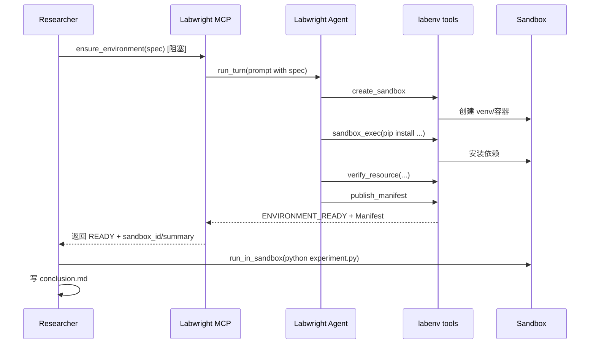
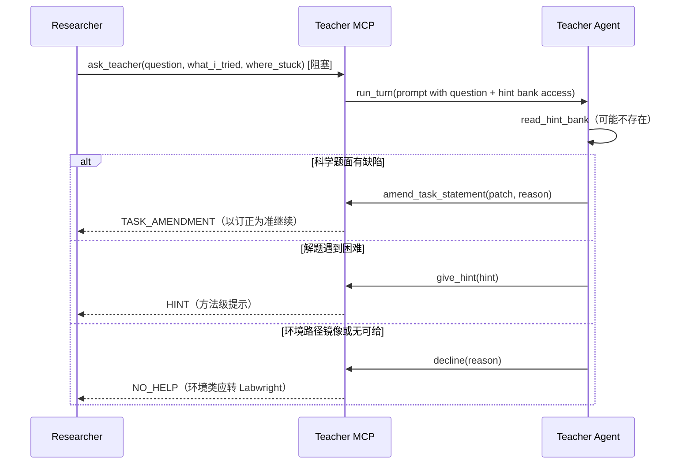

# AGENT.md — 0 号机三 Agent 设计

本文档说明 `zero` 包中 **Researcher**、**Labwright**、**Teacher** 三个 Claude Code Agent 的设计思路、职责边界与协作方式。修改 agent 相关代码前建议先读一遍。

## 一句话

0 号机是一个**三 Agent 科学实验系统**：Researcher 负责「做什么实验」，Labwright 负责「把环境搭好」，Teacher 负责「解题卡住时给提示、科学题面有缺陷时给订正」；三者通过**结构化 MCP 工具**通信，各自拥有**独立的 Claude Code 会话**与**独立的上下文**。

### 职责切分（硬边界）

| Agent | 该管 | 不该管 |
|------|------|--------|
| **Labwright** | 工具、依赖、数据、镜像、挂载、打包可跑环境；题面声明的 starter / `/app/...` 是否到位 | 改科学题面、给解题 hint |
| **Teacher** | 科学方法 HINT；题面**科学内容**缺量/单位/容差/输出契约/自相矛盾 → `TASK_AMENDMENT` | 路径、镜像、装包、「文件夹在哪」——那是环境，应 `decline` |
| **Researcher** | 读题、设计、写代码、分析、结论；环境问题找 Labwright，科学卡壳才问 Teacher | 把装环境问成改题面 |

## 设计原则

| 原则 | 含义 |
|------|------|
| **声明式环境** | Researcher 只声明「需要什么」（`EnvironmentSpec`），不指定「怎么装」 |
| **上下文隔离** | 两个 Agent 各跑一个 CC 会话，互不污染对话历史 |
| **工具化协作** | Agent 之间通过代码定义的 MCP 工具交互，而不是自然语言私聊 |
| **Agent 驱动部署** | Labwright 是完整 Agent，自己规划、试错、修复；**没有外部状态机** |
| **可验证交付** | 环境就绪 = Manifest 里每项资源都经过真实检查，不是 `pip install` 返回 0 就行 |
| **语义边界清晰** | 工程问题 Labwright 自己解决；会改变实验语义的歧义（模型来源、数据集版本等）必须 `NEEDS_DECISION` 交给 Researcher |
| **订正只碰科学题面** | Teacher 的 `TASK_AMENDMENT` 不订正部署说明、镜像标签、宿主机路径 |
| **全程可追踪** | `capgw` 记录每次 LLM 调用；编排层记录工具调用与状态事件，按 `task_id` 缝合 |

## 系统全景

```
用户任务
   │
   ▼
Orchestrator ── 创建 task_id / workspace / runs/<id>/meta/task.json / 双层轨迹
   │
   ├── Researcher（Claude Code，一次性 query 会话）
   │      ├── 文件工具：Read / Write / Edit / Glob / Grep
   │      ├── mcp__sandbox__*     在 Sandbox 里跑实验代码
   │      ├── mcp__labwright__*   声明环境、轮询状态、补资源、回复决策
   │      └── mcp__teacher__*     卡住时提问，拿 HINT 或 TASK_AMENDMENT
   │
   ├── Labwright（Claude Code，持久 ClaudeSDKClient 会话）
   │      └── mcp__labenv__*      创建 sandbox、安装、搜集、挂载、验证、发布 Manifest
   │
   └── Teacher（Claude Code，持久 ClaudeSDKClient 会话，按需懒启动）
          └── mcp__hintbank__*    读本题的人工 hint、给提示、订正题面、拒答

capgw（透明代理）── 三个 Agent 的模型调用分别落到
                    runs/<task_id>/trace/researcher.jsonl
                    runs/<task_id>/trace/labwright.jsonl
                    runs/<task_id>/trace/teacher.jsonl（从未被问到时不产生）

一次任务的全部运行产物都在 ``runs/<task_id>/``（workspace / deliverables / trace /
teacher / resources / logs）；``agent_skills``、``experience/researcher``、``tasks`` 仍为共享输入。
```

## 目录约定

| 路径 | 含义 |
|------|------|
| `runs/<task_id>/` | 该次运行的唯一产物根（状态/资源/sandbox/日志/轨迹） |
| `runs/<task_id>/meta/task.json` | 生命周期状态（删文件夹即释放 run 名） |
| `runs/<task_id>/resources/` | Labwright 下载与缓存 |
| `runs/<task_id>/sandboxes/` | local 后端 sandbox |
| `runs/<task_id>/logs/` | 含 capgw.log |
| `runs/<task_id>/meta/skill_candidates/` | 本 run 提出的 Skill 候选 |
| `runs/<task_id>/workspace/` | 三 Agent 的宿主 cwd |
| `runs/<task_id>/trace/` | Layer 1（capgw）+ Layer 2（编排 events） |
| `runs/<task_id>/teacher/` | asks / 题面订正 / **本次** `hint_bank/` |
| `runs/<task_id>/deliverables/` | 结束时从 sandbox `export/` 拉回的 repo + output |
| `agent_skills/`、`tasks/` | 跨运行共享输入（Skills 需人工发布） |
| `experience/researcher/` | Researcher 轻量经验库（模型 `record_experience` 直写） |

capgw session key 固定为 `<task_id>/trace/<agent>`，因此模型轨迹直接落在
`runs/<task_id>/trace/<agent>.jsonl`。

## 三个 Agent

### Researcher — 科学主控

**职责**：理解任务 → 设计实验 → 声明环境 → 写代码 → 在 Sandbox 执行 → 分析结果 → 写 `conclusion.md`；可检索/沉淀跨 run 经验库。

**会话模型**：`query()` 一次性自治循环（`researcher/agent.py` → `claude_runtime.run_agent`）。一个 task 对应一轮完整对话，从任务 prompt 跑到 `ResultMessage`。

**工具边界**：

- ✅ 读写 workspace 里的实验代码与配置
- ✅ `run_in_sandbox` / `inspect_artifact` 执行与查看结果
- ✅ `ensure_environment` 等 Labwright 接口（声明式）
- ✅ `mcp__experience__*`：检索 / 读取 / **主动写入**共享经验库（非自动从轨迹抽取）
- ❌ 不能直接 `pip install` / `apt` / `docker`（PreToolUse hook 拦截）
- ❌ 不能碰 Labwright 的内部部署细节

**经验库 vs Skills**：短教训 → `record_experience`（立即进 `experience/researcher/`）；长流程 → `propose_reusable_skill`（人工审核）。

**capgw session key**：`<task_id>/trace/researcher`

### Labwright — 环境工程师

**职责**：把 `EnvironmentSpec` 变成已验证的 Sandbox；把题面声明的 starter / 镜像内容 / 数据挂进可跑环境；安装失败时自己诊断重试；语义歧义时暂停并请求 Researcher 决策。

**会话模型**：`ClaudeSDKClient` **持久多轮会话**（`labwright/agent.py`）。同一个 task 内，`ensure_environment`、`add_resources`、`resolve_environment_decision` 各自触发一轮 `run_turn(prompt)`，但**共享同一段对话记忆**，能记住之前装过什么、踩过什么坑。

**工具边界**：

- ✅ `labenv` 全套工具（见下表）；可 Read/Glob/Grep 诊断环境、查找宿主机 starter
- ❌ 不写实验代码、不替 Researcher 做科学选择（模型精度、数据集版本等）
- ❌ 不订正科学题面（路径/镜像问题用交付或 `mark_failed`，不推给 Teacher）

**capgw session key**：`<task_id>/trace/labwright`

### Teacher — 拿着额外 hint 的助教

**职责**：持有**本次运行**的人工 hint bank（`runs/<run>/teacher/hint_bank/*.md`，Researcher 看不到；可用 `--hints` 种子或预放）；Researcher 卡住时向它提问，它先判断这是**科学题面有缺陷**还是**解题遇到困难**，两者给不同的答案：

- **科学题面**缺陷（缺量/缺单位/缺容差/缺输出契约/科学表述自相矛盾）→ `TASK_AMENDMENT`：订正写进本次 `runs/<run>/teacher/task_addendum.md`。
- 解题遇到困难 → `HINT`：方法级操作提示，分级释放，绝不直接给结论性数值。
- **环境/路径/镜像/装包** → `NO_HELP`（decline），明确让对方找 Labwright；**禁止**把部署问题写成 `TASK_AMENDMENT`。
- 没有可给的东西（hint bank 没覆盖、科学题面也没问题）→ `NO_HELP`，拒答是合法答案。

**会话模型**：`ClaudeSDKClient` 持久多轮会话，**懒启动**——只有第一次 `ask_teacher` 才建会话，从未被问过的运行不产生 `runs/<task_id>/trace/teacher.jsonl`，行为与旧版完全一致。

**Skills**：`agent_skills/teacher/skills/teaching`（Researcher 侧对应 `agent_skills/researcher/skills/ask-teacher`）。终端动作标识固定为 `HINT` / `TASK_AMENDMENT` / `NO_HELP`，与 `TeachingKind` 及 MCP 返回的 `kind` 一致。

**工具边界**：

- ✅ `mcp__hintbank__*`：`read_hint_bank` / `give_hint`（→ HINT）/ `amend_task_statement`（→ TASK_AMENDMENT）/ `decline`（→ NO_HELP）
- ❌ 不给 Read/Write/Bash/Sandbox 工具——看不到 Researcher 的 workspace 和轨迹，只能根据提问本身作答
- ❌ 不挂 `lbg-cli`、不设计实验、不写代码、不跑 sandbox、不修环境

**预算护栏**：`ZERO_TEACHER_MAX_ASKS`（默认 8）限制一次运行的提问总数，超限后直接返回 `NO_HELP`，防止 Researcher 把思考外包给老师；每次提问和用掉的 kind 都记入 `runs/<run>/teacher/asks.jsonl`，使「用过 hint」的运行在 benchmark 上可与未用的区分开。

**capgw session key**：`<task_id>/trace/teacher`

### 为什么 Labwright 必须是 full agent？

环境部署本质是**开放域工程问题**：依赖冲突、网络超时、源不可用、传递依赖缺失……固定状态机很难覆盖。让 Agent 带着上下文不断「看 stderr → 换命令 → 再试」更贴近真实运维，也符合「Labwright 就是干这个的 Agent」的定位。

早期 MVP 曾用代码状态机 + 失败时调一次诊断 LLM；现已移除，统一为 Agent 驱动。

## 两层 MCP 工具

Researcher 和 Labwright **看到的工具集不同**，这是刻意的隔离：

### 面向 Researcher：`mcp__labwright__*`（`labwright/mcp_server.py`）

| 工具 | 作用 |
|------|------|
| `ensure_environment` | 提交 `EnvironmentSpec`，**阻塞**直到 Labwright 完成本轮，直接返回终态（READY / NEEDS_DECISION / 失败），无需轮询 |
| `get_environment_manifest` | 查看完整 Manifest（版本、溯源、验证结果） |
| `add_resources` | 实验中增补包/模型/数据集（阻塞返回结果） |
| `resolve_environment_decision` | 回复 `NEEDS_DECISION`（可选择候选或用 `guidance` 自由文本回答开放式问题；阻塞返回后续终态） |
| `report_environment_issue` | 报告疑似环境问题（阻塞：Labwright 诊断修复后返回） |

Researcher 只看到**摘要视图**（`researcher_summary()`），看不到 Labwright 内部的 pip 日志和试错过程。

> **执行模型：阻塞式交接。** 每次 Researcher 侧调用都 `await` 一整轮 Labwright 到完成再返回终态；全程同一时刻只有一个 agent 在跑，没有轮询、没有后台 task。需要 Researcher 拿主意时，Labwright 以 `NEEDS_DECISION` 结束本轮把控制权交回，Researcher 回答后再触发下一轮。

### 面向 Labwright：`mcp__labenv__*`（`labwright/tools.py`）

| 工具 | 作用 |
|------|------|
| `create_sandbox` | 创建 Sandbox（local venv 或 Docker） |
| `sandbox_exec` | 在 Sandbox 内执行命令（pip install、诊断脚本等） |
| `collect_resource` | 从 PyPI/HF/URL 搜集模型或数据集到本地缓存 |
| `mount_resource` | 把缓存资源挂进 Sandbox |
| `verify_resource` | 真实验证（import / --version / 路径可读） |
| `publish_manifest` | 验证通过后发布 Manifest，标记 READY |
| `request_researcher_decision` | 需要科学判断（候选选择或开放式 `question`）→ 结束本轮，控制权交回 Researcher |
| `mark_failed` | 确认无法交付 |

`LabwrightService`（`labwright/service.py`）是胶水层：接收 Researcher 的 MCP 调用 → 构造 prompt → 驱动 `LabwrightAgent.run_turn()` → 把 `LabwrightContext.response` 映射回 `EnvironmentResponse`。

## 协作时序（典型 happy path）



**NEEDS_DECISION 路径**：`collect_resource` 发现多个 HF 候选（或 Labwright 提出开放式 `question`）→ Agent 调 `request_researcher_decision` 并结束本轮 → `ensure_environment` 直接返回 `NEEDS_DECISION` 给 Researcher → Researcher 调 `resolve_environment_decision`（`choose`/`use_source`/`guidance`/`abort`）→ Labwright 收到新 prompt 继续（`source_overrides` / guidance 已写入）→ 返回后续终态。

**Teacher 提问路径**（与 Labwright provisioning 相互独立，可以随时发生）：



> 反例（`materials-phase-01`）：Researcher 因镜像里没有 `/app/phase_audit` 去问 Teacher，Teacher 发了环境类 `TASK_AMENDMENT`——这是职责糊边。正确路径是 `report_environment_issue` / 让 Labwright 找齐 starter。

## 结构化协议（`zero/protocol/`）

| 类型 | 谁写 | 谁读 | 作用 |
|------|------|------|------|
| `EnvironmentSpec` | Researcher | Labwright | 声明需要什么（包、模型、数据集、算力） |
| `EnvironmentManifest` | Labwright | Researcher | 交付物：具体版本、路径、验证结果、溯源 |
| `TeacherAsk` / `TeacherAnswer` | Researcher / Teacher | Teacher / Researcher | 一次提问与其答案（HINT / TASK_AMENDMENT / NO_HELP） |
| `TaskAmendment` | Teacher | Researcher | 题面订正，落在本次 `runs/<run>/teacher/task_addendum.md` |
| `EnvironmentResponse` | LabwrightService | Researcher | 每次 MCP 调用的状态信封 |
| `DecisionRequest` / `ResearcherDecision` | 双方 | 双方 | 语义歧义时的结构化问答 |

`spec_hash` 保证相同 Spec 幂等复用同一个 `request_id`。

## Sandbox 抽象（`zero/sandbox/`）

`SandboxProvider` 屏蔽平台差异（Docker / 本地 venv）。Labwright 和 Researcher 的 `run_in_sandbox` 都走 `SandboxManager`：

- **workspace**：`runs/<task_id>/workspace/`，跨 sandbox 版本保留实验产物
- **resource mount**：模型/数据集以只读方式挂入 `/models/...`、`/datasets/...`
- **snapshot**：`publish_manifest` 时记录可复现 digest

## 编排层（`zero/orchestrator/`）

Orchestrator 不做科学决策，只做**生命周期管理**：

1. 启动 `capgw`（`--out` 指向 `runs/`；session key 含 `/trace/`）
2. `ensure_run_dirs(task_id)`，分配 `task_key`、workspace，写入 `meta/task.json`
3. 实例化 `LabwrightService` + `TeacherService`（若启用）+ 注册 MCP servers
4. 启动 Researcher 自治循环
5. 结束时关闭会话，finalize `deliverables/` + `run.json`（轨迹本已在 `trace/`）

## 轨迹（`zero/trace/` + `capgw`）

| 层 | 内容 | 路径 |
|----|------|------|
| Layer 1 | 每次 LLM 调用（含 CoT） | `runs/<task_id>/trace/{researcher,labwright,teacher}.jsonl` |
| Layer 2 | 编排事件、工具调用、状态迁移 | `runs/<task_id>/trace/events.jsonl` |

`correlate_traces()` 按 `task_id` 与 `<task_id>/trace/<agent>` 关联；`zero viewer` 只读
`runs/*/trace/`，做 Segment Inspector（左脊柱按阻塞交接切段，右栏展开模型/状态）。

## 关键文件

| 路径 | 角色 |
|------|------|
| `zero/researcher/agent.py` | Researcher 配置与一次性 runner |
| `zero/researcher/prompts.py` | Researcher system prompt |
| `zero/experience/store.py` | 跨 run 经验库存储与轻校验 |
| `zero/experience/mcp_server.py` | `search` / `get` / `record` MCP |
| `zero/researcher/hooks.py` | 拦截 pip/apt/docker 等越权命令 |
| `zero/labwright/agent.py` | Labwright 持久会话 |
| `zero/labwright/prompts.py` | Labwright system prompt |
| `zero/labwright/service.py` | MCP 接口 ↔ Agent turn 的胶水 |
| `zero/labwright/tools.py` | `labenv` MCP 工具 + `LabwrightContext` |
| `zero/labwright/mcp_server.py` | 暴露给 Researcher 的 `labwright` MCP |
| `zero/teacher/agent.py` | Teacher 持久会话（懒启动） |
| `zero/teacher/prompts.py` | Teacher system prompt |
| `zero/teacher/service.py` | 阻塞式 ask + 预算 + 题面订正落盘 |
| `zero/teacher/tools.py` | `hintbank` MCP 工具 + `TeacherContext` |
| `zero/teacher/mcp_server.py` | 暴露给 Researcher 的 `teacher` MCP |
| `zero/protocol/teaching.py` | `TeacherAsk` / `TeacherAnswer` / `TaskAmendment` |
| `zero/claude_runtime.py` | 共享：env 构建、`consume_message`、一次性 `run_agent` |
| `zero/protocol/` | Spec / Manifest / Status 的 Pydantic 模型 |
| `zero/sandbox/` | Provider 抽象 + Manager + Researcher 侧 sandbox MCP |
| `zero/state/db.py` | 每 run 状态：`runs/<id>/meta/task.json` |

## 运行与验证

```bash
conda activate zero
cd zero
pip install -e .
python run_e2e.py               # iris 逻辑回归全链路 smoke
python scripts/teacher_smoke.py # Teacher 离线冒烟（不走模型、不建 sandbox）
python scripts/experience_smoke.py  # 经验库读写与校验（不走模型）
```

期望产出：`task_completed`、非空的 `labwright.jsonl` 轨迹、sandbox 中实验可执行。

## 扩展时注意

- **加 Researcher 能力**：改 `researcher/agent.py` 的 `allowed_tools` + prompt；评估是否要放宽 hook。
- **加 Labwright 部署能力**：优先加 `labenv` 工具，再在 `prompts.py` 里说明用法；避免把流程写回状态机。
- **加 Teacher hint**：写入本次 `runs/<run>/teacher/hint_bank/*.md`，或 `zero run --hints <file|dir>`；不用改代码。
- **经验库条目**：由 Researcher 在会话中 `record_experience`；宿主只做轻校验，不人工审核。
- **换 Sandbox 后端**：只动 `sandbox/` 下的 Provider，Agent 层不动。
- **新 Agent**：需要独立 CC 会话 + 独立 capgw session key + 独立 MCP 工具面；不要和现有 Agent 共享 system prompt 或工具集。
